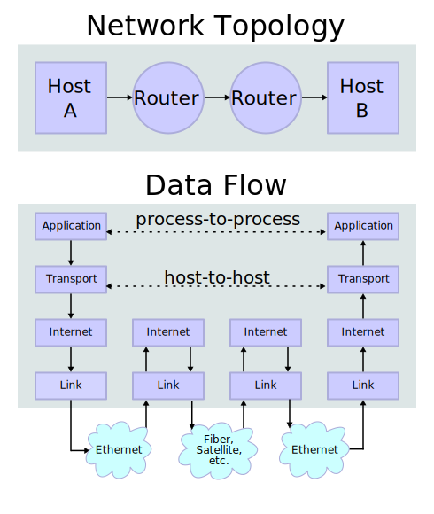

## What is Networking model ?

A networking model is a conceptual framework that describes how different elements of a network interact and communicate with each other.

Networking models categorize and provide a structure for networking **protocols** and **standards**.

#### What is networking protocols ?

A networking protocol is a set of rules and standards that define how devices on a network communicate with each other. Protocols are used to establish connections, transmit data, and ensure that data is transmitted reliably and in the correct order. They also establish how data is packaged, addressed, routed, and received.

---

## OSI Model

The OSI (Open Systems Interconnection) model is a framework used to understand and standardize how different communication protocols and technologies work together. It defines seven layers, each with a specific function, that work together to enable communication between devices on a network. The OSI model is a way to understand how the different protocols and technologies used in networking relate to each other and to the overall process of transmitting data over a network.

- Created by the "International Organization for Standardization" (ISO).

- Functions are divided into 7 Layers.


<span style="color:orange;font-weight:bold;font-size:21px;">7. Application Layer : </span> The Application Layer is the highest layer of the OSI (Open Systems Interconnection) model and <span style="color:#d19a66">**it is responsible for providing the interface between the application and the network.**</span> It defines the protocols and standards that are used to enable communication between applications and the network. The main goal of the Application Layer is to provide services that allow the application to access the network.

Here are a few examples of the functions and protocols that are typically associated with the Application Layer:

- <span style="color:#6699CC;font-weight:bold">Providing services to the application</span> : The Application Layer provides services such as file transfer, email, remote login, and database access to the application. For example, the File Transfer Protocol (FTP) is used to transfer files between computers, and the Simple Mail Transfer Protocol (SMTP) is used to send and receive email.

- <span style="color:#6699CC;font-weight:bold">Translating application data</span> : The Application Layer is responsible for converting application data into a format that can be transmitted across the network and then converting the received data back into a format that can be understood by the application. For example, the Hypertext Transfer Protocol (HTTP) is used to transmit web pages across the Internet, and the Simple Object Access Protocol (SOAP) is used to send and receive messages in web services.

- <span style="color:#6699CC;font-weight:bold">Authentication and security</span> : The Application Layer is responsible for ensuring that only authorized users can access the network and that the data being transmitted is secure. For example, the Secure Sockets Layer (SSL) and Transport Layer Security (TLS) are used to encrypt data that is transmitted over the Internet, and the Remote Authentication Dial-In User Service (RADIUS) is used to authenticate users who are trying to connect to a network.

Application layer protocols: `HTTP`, `HTTPS`, `FTP`, `SMTP`, `DNS`, `DHCP`, `SNMP`, `NFS` are some examples of application layer protocols.

It is important to note that the Application Layer does not interact directly with the network, but rather it communicates with the underlying layers, such as the Transport and Network Layers, which handle the actual transmission of data across the network. The Application Layer protocols are designed to be independent of the underlying network architecture, allowing the same application to work on different networks.

Functions of Layer 7 include:

- Identifying communication partners
- Synchronizing communication

#### Adjacent Layer Interaction


Both the **encapsulation** and **de-encapsulation** processes are examples of **Adjacen-layer-interaction** between the different layers of OSI model.

<br>

#### Same Layer Interaction


The communication between the **application layers** of the two different systems, is called **same-layer** interaction.

This **same-layer** ineraction between application layers is what allows the application layer to perform it's functions of **identifying** communication partners, **synchronizing communications**, etc.

<br>

<span style="color:orange;font-weight:bold;font-size:21px">6. Presentation Layer :</span> The Presentation Layer is the sixth layer of the OSI (Open Systems Interconnection) model and <span style="color:#d19a66">**it is responsible for converting data into a format that can be understood by the application. It also provides encryption and compression for the data.**</span> The main goal of the Presentation Layer is to provide a standard representation of the data that is being transmitted between devices on the network.

Here are a few examples of the functions and protocols that are typically associated with the Presentation Layer:

- <span style="color:#6699CC;font-weight:bold">Data conversion</span> : The Presentation Layer is responsible for converting data between different formats.

  For example, it can convert text data into binary data, or vice versa. It can also convert data between different character encodings, such as ASCII and Unicode.

- <span style="color:#6699CC;font-weight:bold">Data compression</span> : The Presentation Layer can also compress data to reduce the amount of bandwidth needed to transmit it. This can improve the performance of the network by reducing the amount of data that needs to be transmitted.

  Some examples of data compression algorithms used in the Presentation Layer are: Huffman encoding, Lempel-Ziv-Welch (LZW) algorithm, and run-length encoding.

- <span style="color:#6699CC;font-weight:bold">Data encryption</span> : The Presentation Layer can also encrypt data to protect it from unauthorized access. Encryption algorithms such as RSA, AES, and DES are typically used to encrypt data at the Presentation Layer.

- <span style="color:#6699CC;font-weight:bold">Presentation layer protocols</span> : ASCII, EBCDIC, JPEG, TIFF, MPEG, MIDI, PICT, and QuickTime are some examples of presentation layer protocols.

It is important to note that the Presentation Layer does not define any specific protocols, but rather it provides a common interface for the application and the network, allowing them to communicate in a standardized format. The Presentation Layer protocols, such as ASCII and EBCDIC, are not widely used today as most of the data transfer happens in binary format.

<br>

<span style="color:orange;font-weight:bold;font-size:21px">5. Session Layer :</span> The Session Layer is the fifth layer of the OSI (Open Systems Interconnection) model, <span style="color:#d19a66">**it is responsible for establishing, maintaining, and terminating connections between applications on different devices.**</span> It also controls the flow of data between the devices. The main goal of the Session Layer is to provide a way for applications on different devices to communicate with each other in a coordinated and organized manner.

Here are a few examples of the functions and protocols that are typically associated with the Session Layer:

- <span style="color:#6699CC;font-weight:bold">Session establishment</span> : The Session Layer is responsible for establishing a session between two applications on different devices. This can include negotiation of the parameters of the session, such as the type of data that will be exchanged, and the protocols that will be used.

- <span style="color:#6699CC;font-weight:bold">Session management</span> : Once a session is established, the Session Layer is responsible for maintaining it. This includes keeping track of the state of the session, such as whether it is active or inactive, and handling any errors that may occur during the session.

- <span style="color:#6699CC;font-weight:bold">Session termination</span> : The Session Layer is also responsible for terminating a session when it is no longer needed. This can include releasing any resources that were allocated during the session, and notifying the applications that the session has been terminated.

- <span style="color:#6699CC;font-weight:bold">Session layer protocols</span> : Some examples of session layer protocols are: Remote Procedure Call (RPC), Named Pipes, NetBIOS, and X Window System.

It is important to note that the Session Layer is not commonly used today as many modern network protocols and applications do not require the explicit establishment and management of sessions. The functionality of session layer is often embedded in the application layer protocols.

> Note: Network engineers don't usually work with the top 3 layers. Application developers work with the top layers of the OSI model to connect their applications over networks.

<br>

<span style="color:orange;font-weight:bold;font-size:21px">4. Transport Layer</span> : The transport layer is the fourth layer of the OSI (Open Systems Interconnection) reference model, which is used to describe how data is transmitted over a network. <span style="color:#d19a66">**It is responsible for providing end-to-end communication services between applications running on different devices.**</span>

The main function of the transport layer is to ensure the reliable delivery of data between two devices. It does this by providing a variety of services, such as segmentation and reassembly of data, flow control, and error checking.


One of the main protocols used at the transport layer is the Transmission Control Protocol (TCP). <span style="color:#d19a66">**TCP is a connection-oriented protocol that establishes a virtual circuit between two devices before any data is exchanged.**</span> This allows for reliable data transfer, as TCP can detect and recover from any errors that may occur during transmission.

Another common protocol used at the transport layer is the User Datagram Protocol (UDP). <span style="color:#d19a66">**Unlike TCP, UDP is a connectionless protocol that does not establish a virtual circuit before data is exchanged.**</span> This makes it a faster and more efficient option for applications that don't require the reliability of TCP.

An example of a transport layer protocol in action is when you load a webpage in your browser. The browser sends a request to the server for the webpage using HTTP (Hypertext Transfer Protocol), which runs on top of TCP. The server then sends the requested webpage back to the browser over the same TCP connection.

Another example is video conferencing application like Zoom. <span style="color:#d19a66">**The video and audio data are sent as packets over the internet**</span>, and the transport layer protocols like UDP are used to ensure that the packets are delivered quickly and efficiently to the correct destination.

In summary, the transport layer plays a crucial role in ensuring the reliable and efficient delivery of data across a network. It provides a variety of services such as segmentation, flow control, and error checking, and uses protocols like TCP and UDP to accomplish this.

<br>

<span style="color:orange;font-weight:bold;font-size:21px">3. Network Layer :</span> The network layer is the third layer of the OSI (Open Systems Interconnection) reference model, which is used to describe how data is transmitted over a network. <span style="color:#d19a66">**It is responsible for routing and forwarding data packets between devices on a network.**</span> The main function of the network layer is to ensure that data packets are delivered to the correct destination by routing them through the appropriate paths in a network.

One of the main protocols used at the network layer is the Internet Protocol (IP). IP is the primary protocol used to route and forward data packets on the internet. <span style="color:#d19a66">**It is responsible for addressing and identifying devices on a network, and for determining the best path for data packets to travel to reach their destination.**</span>

Another common protocol used at the network layer is the Internet Control Message Protocol (ICMP). ICMP is used to send error messages and operational information about network conditions, such as when a destination host or network is unreachable.

An example of the network layer in action is when you use a web browser to load a webpage. When you enter the webpage's URL, your computer sends a request to a DNS (Domain Name System) server to resolve the URL to an IP address. This is the first step in the process of routing the request to the correct server. Once the IP address is obtained, the request is sent to the server over the internet via IP packets. These packets are then routed through various routers and switches on the network, until they reach the server, where the requested webpage is sent back to the client.

Another example is when you send an email. The network layer protocol (IP) is responsible for addressing the email message and routing it through the internet to the recipient's mail server.

In summary, the network layer plays a crucial role in ensuring that data packets are delivered to the correct destination by routing them through the appropriate paths in a network. It uses protocols like IP and ICMP to accomplish this, and it is used in everyday applications such as web browsing, email and file transfer.

<br>

<span style="color:orange;font-weight:bold;font-size:21px">2. Data Link Layer :</span> The Data Link Layer is the second layer of the OSI (Open Systems Interconnection) reference model, which is used to describe how data is transmitted over a network. <span style="color:#d19a66">**It is responsible for creating a link between devices on the same network segment.**</span> It deals with the physical addressing of devices and the organization of data into frames, which are the units of data that are transmitted at the data link layer.

The main function of the data link layer is to provide reliable data transfer between devices on a local network. It does this by providing error detection and correction, as well as flow control and media access control.

There are two sublayers of the data link layer: the Logical Link Control (LLC) and the Media Access Control (MAC). The LLC sublayer provides flow control and error detection, while the MAC sublayer provides media access control and physical addressing.

One of the main protocols used at the data link layer is the Ethernet. Ethernet is a standard for wired LAN (Local Area Network) that uses CSMA/CD (Carrier Sense Multiple Access with Collision Detection) for media access control. It specifies the physical and data link layers of the OSI model.

Another example of Data Link Layer is when you use a wireless network, the data link layer protocol is Wireless LAN (WLAN) protocol like IEEE 802.11 which provides the mechanism for wireless device to communicate with each other, providing features such as access control, error detection and correction, and flow control.

In summary, the Data Link Layer plays a crucial role in ensuring reliable data transfer between devices on a local network. It provides error detection and correction, flow control and media access control, and uses protocols like Ethernet and IEEE 802.11 to accomplish this. It deals with physical addressing of devices and the organization of data into frames. It is used in everyday applications such as wired and wireless LANs.

<br>

<span style="color:orange;font-weight:bold;font-size:21px">1. Physical Layer :</span> The Physical Layer is the first layer of the OSI (Open Systems Interconnection) reference model, which is used to describe how data is transmitted over a network. <span style="color:#d19a66">**It is responsible for the physical connection between devices on a network, and for transmitting raw bits of data over a communication channel.**</span> It deals with the physical characteristics of the network such as signaling method, cable type, and connector type.

The main function of the physical layer is to establish, maintain and terminate the physical link between devices. <span style="color:#d19a66">**It also provides the means for transmitting and receiving raw bits of data over the communication channel.**</span> The physical layer is responsible for the electrical, mechanical, functional and procedural characteristics of the interface between the communication equipment and the transmission medium.

Examples of the Physical Layer are the various types of cables and connectors used to connect devices to a network. For example, Ethernet cables (RJ45) and connectors, fiber-optic cables and connectors, and coaxial cables are all examples of physical layer technologies.

Another example is when you use a wireless network, the physical layer protocol is the radio frequency (RF) technology that transmits and receives signals over the air. The physical layer protocols define the characteristics of the RF signals such as the frequency band, modulation, and transmit power levels that are used to connect the devices.

In summary, the Physical Layer plays a crucial role in the establishment, maintenance, and termination of the physical link between devices, and for transmitting and receiving raw bits of data over the communication channel. It deals with the physical characteristics of the network such as signaling method, cable type, and connector type. It is used in everyday applications such as wired and wireless LANs, and it uses technologies like cables, connectors and RF to accomplish this.

---

# Network Layer's Header and Trailer

.png>)

A Protocol Data Unit (PDU) refers to the specific format and structure of data that is exchanged between network devices using a specific protocol. The PDU contains both control information and user data. The structure of a PDU can vary depending on the protocol being used.

Layer 1 (Physical Layer) PDU is called `"bit"`.

As data is transmitted through the network, each layer adds a header or trailer to the data packet, which contains information specific to that layer.

- <span style="color:#6699CC;font-weight:bold">The Physical Layer :</span> This layer deals with the physical connection between devices on a network. It adds no headers or trailers to the data packet.

- <span style="color:#6699CC;font-weight:bold">The Data Link Layer :</span> This layer is responsible for creating a link between devices on the same network segment. It adds a header and trailer to the data packet, known as a Frame. The header contains information such as the source and destination MAC addresses, and the trailer contains error checking information.

- <span style="color:#6699CC;font-weight:bold">The Network Layer :</span> This layer is responsible for routing data packets between devices on a network. It adds a header to the data packet, known as an IP packet. The header contains information such as the source and destination IP addresses, and the packet's routing information.

- <span style="color:#6699CC;font-weight:bold">The Transport Layer :</span> This layer is responsible for providing end-to-end communication services between applications running on different devices. It adds a header to the data packet, known as a segment. The header contains information such as the source and destination ports, and the protocol being used (TCP or UDP).

- <span style="color:#6699CC;font-weight:bold">The Session Layer :</span> This layer is responsible for establishing and maintaining communication sessions between devices. It adds a header to the data packet, known as a session header. The header contains information such as the session ID and status of the connection.

- <span style="color:#6699CC;font-weight:bold">The Presentation Layer :</span> This layer is responsible for converting data into a format that can be understood by the application layer. It adds a header or trailer to the data packet, known as a presentation header or trailer. The header or trailer contains information such as the data's encoding format.

- <span style="color:#6699CC;font-weight:bold">The Application Layer :</span> This layer is responsible for providing the interface between the user and the network. It adds no headers or trailers to the data packet.

An example of the OSI model in action is when you use a web browser to load a webpage. The browser sends a request to the server for the webpage using HTTP (Hypertext Transfer Protocol), which runs on top of TCP at the application layer. The transport layer adds a header containing the source and destination ports, and the protocol being used (TCP) to the data packet. The network layer adds a header containing the source and destination IP addresses, and the packet's routing information to the data packet. The data link layer adds a header and trailer containing the source and destination MAC addresses and error checking information to the data packet. And finally, the physical layer transmit the packet over the network.

In summary, as data is transmitted through the network, each layer of the OSI model adds a header or trailer to the data packet, which contains information specific to that layer. This allows for the efficient and accurate transmission of data across a network.

---

# TCP/IP Suite

<div>



</div>

---

# Ethernet LAN Switching

### Local Area Network (LAN)

A Local Area Network (LAN) is a group of interconnected devices that share a common communication protocol and are located in a relatively small geographic area, such as a single building or campus. LANs allow devices to communicate and share resources, such as files and printers, within the network.

A LAN is typically composed of a number of devices, including computers, servers, switches, routers, and other network devices. These devices are connected to each other using a variety of technologies, such as Ethernet, Wi-Fi, or Token Ring.

There are several types of LANs, each with its own characteristics and use cases. Some examples of LANs include:

- `Ethernet LAN`: This is the most common type of LAN, and it uses the Ethernet protocol to connect devices. Ethernet LANs are used in homes, small businesses, and large enterprises. They can be connected using wired or wireless technologies.

- `Wireless LAN (WLAN)`: This type of LAN uses wireless technology, such as Wi-Fi, to connect devices. Wireless LANs are becoming increasingly popular in homes, businesses, and public spaces, such as airports and coffee shops.

- `Token Ring LAN`: This type of LAN uses the Token Ring protocol to connect devices. Token Ring LANs are less common than Ethernet LANs, but they are still used in some industrial and military applications.

- `Peer-to-peer LAN`: This is a type of LAN in which each device can act as both a client and a server, allowing users to share files and resources without the need for a central server.

- `Client-Server LAN`: This is a type of LAN in which a central server manages and controls network resources, such as files, printers and other devices.

Each LAN has its own advantages and disadvantages and is used in different scenarios, for example, Ethernet LANs are widely used in small businesses and homes, while Wireless LANs

<br>

### Ethernet Frame


- `Preamble (10101010 * 7) & SFD (10101011)`: They are used for synchronization and error detection purposes.

  The preamble is a 7-byte field that is used to synchronize the clocks of the transmitting and receiving devices. It is a pattern of alternating 1s and 0s (10101010) that serves as a "wake-up" signal to the receiving device, letting it know that a frame is about to be sent. This allows the receiving device to adjust its clock and be ready to receive the incoming frame.

  <span style="color:#d19a66">**In Ethernet, synchronizing clocks refers to the process of ensuring that the clocks of the transmitting and receiving devices are in sync. This is important because it ensures that the data being sent is received at the correct time and in the correct order.**</span>

  <span style="color:#d19a66">**The Start Frame Delimiter (SFD) is a 1-byte field that is used to mark the beginning of the actual data (payload) in an Ethernet frame.**</span> It is used to ensure that the receiving device is able to accurately detect the start of the frame, even in the presence of noise or other errors.

  the Start Frame Delimiter (SFD) is used to mark the beginning of the actual data (payload) in the frame. It serves as a marker that tells the receiving device exactly where the payload of the frame begins and where the header information ends.

  An example of how the preamble and SFD are used in an Ethernet frame:

  A device wants to send an Ethernet frame to another device on the network. The frame contains the data "Hello World" as the payload. The sender first sends the preamble (10101010 10101010 10101010 10101010 10101010 10101010 10101010) to the receiver, this is a wake-up signal to the receiver, letting it know that a frame is about to be sent, the receiver adjusts its clock accordingly. After that, the sender sends the SFD (10101011) which marks the start of the actual data (payload). The sender then sends the payload "Hello World" and the rest of the Ethernet frame, including the destination and source MAC addresses, type/length, FCS and other fields.

  In summary, the preamble is a 7-byte field that is used to synchronize the clocks of the transmitting and receiving devices, and the SFD is a 1-byte field that is used to mark the beginning of the actual data (payload) in an Ethernet frame, this ensures that the receiving device is able to accurately detect the start of the frame, even in the presence of noise or other errors.

  <br>

- `Destination (6-byte) & Source (6-byte)`: In an Ethernet frame, the destination and source fields are used to identify the devices that are sending and receiving the data.

  The destination field, also called the Destination MAC Address, is a 6-byte field that contains the MAC (Media Access Control) address of the device to which the data is being sent. The MAC address is a unique identifier assigned to each device on a network, and it is used to identify the device at the Data Link Layer (layer 2) of the OSI model.

  The source field, also called the Source MAC Address, is a 6-byte field that contains the MAC address of the device that is sending the data. This allows the receiving device to identify the source of the data and respond accordingly.

  For example, if a device with the MAC address 00:11:22:33:44:55 wants to send data to another device with the MAC address 66:77:88:99:AA:BB, the sender would include the destination MAC address (66:77:88:99:AA:BB) in the destination field of the Ethernet frame, and its own MAC address (00:11:22:33:44:55) in the source field. The receiving device would then use the destination MAC address to determine that the data is intended for it, and it would use the source MAC address to know the identity of the sender.

  In summary, the destination and source fields in an Ethernet frame are used to identify the devices that are sending and receiving the data, the destination field contains the MAC address of the device to which the data is being sent and the source field contains the MAC address of the device that is sending the data. This allows the receiving device to identify the source of the data and respond accordingly.

  <br>

- `Type (2-byte) or Length (2-byte)`: In an Ethernet frame, the "Type" or "Length" field is used to indicate the type of data that is contained in the payload of the frame or the length of the payload.

  

  When the field is called "Type", it is a 2-byte field that indicates the type of data that is contained in the payload. <span style="color:#d19a66">**This field is used to identify the upper-layer protocol that is being used to transport the data. For example, the value `0x0800` indicates that the payload contains an IP packet, and the value `0x0806` indicates that the payload contains an ARP packet.**</span>

  When the field is called "Length", it is a 2-byte field that indicates the length of the payload in bytes. This field is used to identify the size of the payload, this information is useful for the receiving device to allocate the appropriate buffer size to receive the data.

  In some cases, the "Type" or "Length" field can also be used to indicate the priority of the packet, which is useful for Quality of Service (QoS) purposes.

  For example, if a device wants to send an Ethernet frame containing an IP packet with a payload of 1000 bytes, it would include the value 0x0800 in the "Type" field to indicate that the payload contains an IP packet and the value 1000 in the "Length" field to indicate the size of the payload.

  In summary, the "Type" or "Length" field in an Ethernet frame is used to indicate the type of data that is contained in the payload of the frame or the length of the payload.

  <br>

- `FCS (4-byte)`: The FCS (Frame Check Sequence) field in an Ethernet frame is used to detect errors in the data that is being transmitted. <span style="color:#d19a66">**The FCS field is a 32-bit cyclic redundancy check (CRC) value that is calculated by the sender and appended to the end of the Ethernet frame. The receiver then recalculates the FCS value and compares it to the value received in the frame. If the values match, it indicates that the frame was transmitted without errors.**</span>

  CRC (Cyclic Redundancy Check) is a type of error-detecting code commonly used in digital networks and storage devices to detect accidental changes to raw data. It is based on a mathematical algorithm that generates a fixed-size bit string, called a check value or CRC, for a given data. The check value is then appended to the data and transmitted. The receiver can then recalculate the check value for the received data and compare it to the check value received in the transmission. If the values match, it indicates that the data was transmitted without errors.

  Here is an example of how a CRC value is calculated for a given data:

  Consider a data of "Hello World"
  The data is represented in binary form as 01001000 01100101 01101100 01101100 01101111 00101100 01110111 01101111 01101110 01100101 01101100 01100100
  A standard polynomial function is used to calculate the CRC value, for example, the function is x^3+x+1
  The data is divided into k bit segments, where k is the degree of the polynomial function
  The segments are then multiplied by x^3 and added together to form a new polynomial
  The new polynomial is then divided by the standard polynomial function and the remainder is the CRC value.
  In this example, the data "Hello World" was divided into 8-bit segments and multiplied by x^3 and the remainder obtained is the CRC value, that is appended to the data and sent across the network.

  It's worth noting that there are many different algorithms used to calculate CRC values and different standard polynomial function can be used based on the specific application. Also, the degree of the polynomial function can also vary, depending on the specific application and the level of error detection required.

  An example of how the FCS field works:

  1. A sender wants to transmit an Ethernet frame containing data "Hello World"

  2. The sender calculates the 32-bit FCS value for the data using a specific mathematical algorithm

  3. The FCS value is then appended to the end of the Ethernet frame, and the frame with the data and FCS value is transmitted

  4. The receiver receives the frame and recalculates the FCS value for the received data

  5. If the calculated FCS value by the receiver matches the FCS value received in the frame, the receiver concludes that the data was transmitted without errors

  6. If the calculated FCS value by the receiver does not match the FCS value received in the frame, the receiver concludes that an error occurred during transmission and discards the frame

  This is a basic example of how the FCS field is used to detect errors in Ethernet frames. Note that FCS field is used to detect errors but not to correct them.

<br>

### MAC Address


A MAC (Media Access Control) address is a unique identifier assigned to network interfaces for communications on the physical network segment. <span style="color:#d19a66">**It is a 12-character hexadecimal string**</span> that is used to identify the source and destination of packets on a network. A MAC address is also known as a hardware address or physical address.

Written as 12 **hexadecimal** characters.

A MAC address is typically composed of two parts: the first part is called the organizationally unique identifier (OUI), which identifies the manufacturer of the network interface card (NIC), and the second part is the device identifier, which identifies the specific NIC within the manufacturer's product line.

An example of a MAC address is "00:11:22:33:44:55." The first three octets (00:11:22) represent the OUI, **which is assigned by the IEEE to the NIC manufacturer**, and the last three octets (33:44:55) represent the device identifier.

MAC addresses are used in the Media Access Control protocol, which is a communication protocol used in networks that conform to the OSI model. Each device connected to a network has a unique MAC address, which is used to identify the device and the source and destination of packets on the network.

MAC addresses are used in many different types of networks, including Ethernet networks, Wi-Fi networks, and Bluetooth networks. They are also used in other communication protocols such as Token Ring and FDDI.

In summary, A MAC address is a unique identifier assigned to network interfaces, it is used to identify the devices and the source and destination of packets on a network. It is a 12-character hexadecimal string that is composed of two parts; the first part is the OUI, assigned by IEEE to the NIC manufacturer, and the second part is the device identifier. It is used in many different types of networks, including Ethernet, Wi-Fi, and Bluetooth networks.

### MAC (Media Access Control) Address Table or CAM (Content Addressable Memory) Table


<span style="color:#d19a66">**A MAC address table, also known as a forwarding table or content-addressable memory (CAM) table, is a data structure used by network devices such as switches and routers to store and retrieve the MAC addresses of devices connected to the network.**</span> The table is used to map the MAC addresses of devices to their corresponding network interfaces, which allows the device to forward packets to the correct destination.

MAC addresses can be learned by a network device in two ways:

1. `Dynamically learned`: <span style="color:#d19a66">**A device learns the MAC addresses of other devices on the network by observing the source MAC address of incoming packets.**</span> The device adds the source MAC address and its corresponding port to the MAC address table. This is known as dynamic address learning, and it is done automatically by the device.

> Note: Dynamic MAC addresses are removed from The MAC address table after 5 minutes of inactivity.

For example, when a device A sends a packet to a device B, the switch receives the packet and learns the MAC address of device A, it maps the MAC address of device A to the port where it received the packet from.

2. `Static learned`: A device administrator can manually configure the MAC addresses and their corresponding ports in the MAC address table. This is known as static address learning.

For example, an administrator can configure the MAC address of a device C and map it to a specific port, this way the switch will always forward the packets addressed to device C to the specific port.

Static learning is useful for devices that do not support dynamic learning, or for devices that are not supposed to move around the network.

In summary, A MAC address table is a data structure used by network devices to store and retrieve the MAC addresses of devices connected to the network. The table is used to map the MAC addresses of devices to their corresponding network interfaces, which allows the device to forward packets to the correct destination. There are two ways to learn the MAC address: Dynamically learned and statically learned. Dynamically learned is done automatically by the device by observing the source MAC address of incoming packets and statically learned is done manually by the administrator.

<br>

### Flood Frame

When a switch receives a frame with an <span style="color:#d19a66">**unknown destination MAC address**</span>, it will flood the frame to all connected devices on the network. **Flooding is a mechanism used by switches to ensure that a frame reaches its intended destination even if the destination MAC address is not known.**

The process of flooding a frame typically works as follows:

1. The switch receives a frame with an unknown destination MAC address.

2. The switch checks its MAC address table to see if the destination address is in it, but since the destination address is not in the table, <span style="color:#d19a66">**the switch considers it as an unknown unicast frame.**</span>

3. The switch then floods the frame to all connected devices on the network, except for the port where the frame was received.

4. Each device on the network receives the frame and checks the destination MAC address.

5. If the destination MAC address matches the device's own MAC address, the device will process the frame.

6. If the destination MAC address does not match the device's own MAC address, the device will discard the frame.

For example: A device A sends a packet to Device C. Device C is not currently connected to the network or the MAC address of Device C is incorrect. The switch receives the packet and checks its MAC address table to see if the destination address is in it, but since the destination address is not in the table, the switch floods the frame to all connected devices on the network, except for the port where the frame was received. Each device on the network receives the frame and checks the destination MAC address, if the destination MAC address matches the device's own MAC address, the device will process the frame otherwise it will discard the frame.

<span style="color:#d19a66">**It's worth noting that Flooding is a normal process of operation in a switched LAN, but it can lead to network congestion and bandwidth wastage if it happens too often. To prevent flooding, switches use techniques such as learning the MAC addresses of devices on the network and updating the MAC address table dynamically.**</span>

In summary, When a switch receives a frame with an unknown destination MAC address, it will flood the frame to all connected devices on the network. Flooding is a mechanism used by switches to ensure that a frame reaches its intended destination even if the destination MAC address is not known. Each device on the network receives the frame and checks the destination MAC address. If the destination MAC address matches the device's own MAC address, the device will process the frame otherwise it will discard the frame. Flooding can lead to network congestion and bandwidth wastage if it happens too often, to prevent flooding, switches use techniques such as learning the MAC addresses of devices on the network and updating the MAC address table dynamically.

<br>

### Flooding frame VS Broadcasting frame

Flooding and broadcasting are similar in that both involve sending a frame to multiple devices on a network, but there are some key differences between the two:

- `Flooding` is a mechanism used by switches to ensure that a frame reaches its intended destination even if the destination MAC address is not known. When a switch receives a frame with an unknown destination MAC address, it will flood the frame to all connected devices on the network, except for the port where the frame was received. The goal is to get the frame to its intended destination by allowing all devices on the network to process it, and the packet is discarded if the destination address doesn't match.

- `Broadcasting`, on the other hand, is a mechanism used to send a frame to all devices on a network. <span style="color:#d19a66">**The destination address in a broadcast frame is a special address that is recognized by all devices on the network, such as the broadcast address 255.255.255.255. The goal is to reach all the devices on the network, and the packet is processed by all the devices.**</span>

In summary, Flooding and broadcasting are similar in that both involve sending a frame to multiple devices on a network, but there are key differences between them. Flooding is a mechanism used by switches to ensure that a frame reaches its intended destination even if the destination MAC address is not known. Broadcasting, on the other hand, is a mechanism used to send a frame to all devices on a network, the goal is to reach all the devices on the network.

### Some Important Notes of Ethernet Frame

- The <span style="color:#d19a66">**Preamble + SFD**</span> is usually not considered part of the Ethernet header.

- Therefore the size of the Ethernet header + trailer is 18 bytes (6 + 6 + 2 + 4).

- The minimum size for an Ethernet frame (Header + Payload(Packet) + Trailer) is <span style="color:#d19a66">**64 bytes**</span>.

- <span style="color:#d19a66">**64 bytes - 18 bytes**</span> (header + trailer size) = 46 bytes

- Therefore the minimum payload (packet) size is 46 bytes.

- if the payload is <span style="color:#d19a66">**less than 46 bytes**</span>, padding bytes are added.

  e.g 34-byte packet + 12-byte padding (will be added) = 46 bytes

- [Watch Ethernet LAN switching simulation](https://www.youtube.com/watch?v=5q1pqdmdPjo&list=PLxbwE86jKRgMpuZuLBivzlM8s2Dk5lXBQ&index=11)

<br>

### ARP (Address Resolution Protocol)


<span style="color:#d19a66">**ARP (Address Resolution Protocol) is a protocol used to map an IP address to a physical (MAC) address on a local network. It is used to determine the hardware address of a device on a network, when only its IP address is known.**</span>

When a device on a network wants to communicate with another device, it first needs to determine the MAC address of the destination device. The device sends out an ARP request packet, which is broadcast to all devices on the local network. The packet contains the IP address of the destination device.

The device with the matching IP address responds with an ARP reply packet, which contains its MAC address. The requesting device can then use this information to send data packets directly to the destination device.

For example, let's say device A (192.168.1.2) wants to communicate with device B (192.168.1.3). Device A will send an ARP request packet to the local network, with the destination IP address of 192.168.1.3. Device B receives the packet and recognizes that its IP address is included in the request, so it responds with its own MAC address, which is 00:11:22:33:44:55. Device A can now use this information to send data packets directly to Device B using the MAC address 00:11:22:33:44:55.

- <span style="color:#d19a66">**ARP Request**</span> is <span style="color:#d19a66">**broadcast**</span> = sent to all hosts on the network.

- <span style="color:#d19a66">**ARP Reply**</span> is <span style="color:#d19a66">**unicast**</span> = sent only to one host (the host that sent the request) on the network.

<br>

### Broadcast MAC Address (FF:FF:FF:FF:FF:FF)

A broadcast MAC address is a special type of MAC address that is used to send data packets to all devices on a local network. The broadcast MAC address is typically represented by the hexadecimal value FF:FF:FF:FF:FF:FF.

In Ethernet networks, when a device wants to send a broadcast packet, it will set the destination MAC address to the broadcast address (FF:FF:FF:FF:FF:FF) and the packet will be sent to all devices on the local network.

Broadcast packets are used for various network protocols and services such as Address Resolution Protocol (ARP) requests, Internet Control Message Protocol (ICMP) packets, and Dynamic Host Configuration Protocol (DHCP) requests.

For example, let's say a device wants to discover all devices on the local network, it will broadcast an ARP request packet with the destination MAC address set to the broadcast address (FF:FF:FF:FF:FF:FF). All devices on the local network will receive the packet, and the devices with matching IP addresses will respond with their own MAC addresses.

Another example, DHCP is a protocol that allows devices to automatically obtain an IP address from a DHCP server on the network. When a device connects to the network for the first time, it will broadcast a DHCP request packet with the destination MAC address set to the broadcast address (FF:FF:FF:FF:FF:FF). This packet will be received by all devices on the local network, including the DHCP server. The DHCP server will respond with an offer of an IP address, and the device can then use this IP address to communicate on the network.

It's worth noting that broadcast packets are not forwarded by routers, they are only intended to be received by devices on the same network segment.

<br>

### How 'switch' respond on 'ARP request' and 'ARP reply'

An ARP request packet is considered an "unknown unicast" frame by a switch because the destination MAC address in the packet is not yet known to the switch. A unicast frame is a frame that is sent to a single destination, whereas a broadcast frame is sent to all devices on the local network.

When a switch receives an ARP request packet, it will flood the packet out all of its ports except the port on which it was received, in an attempt to find the device with the matching IP address. This is because the switch does not yet know the MAC address of the device with the IP address specified in the packet, so it sends the packet to all devices on the network in the hope that the device with the matching IP address will respond.

When the device with the matching IP address responds with its own ARP reply packet, the switch will learn the device's MAC address and update its MAC address table. The switch will then use this information to forward any subsequent frames destined for that device directly to the appropriate port, rather than flooding them out all ports. This is known as a "known unicast" frame.

As for the broadcast MAC address, it is used by switches to identify broadcast frames, which are intended for all devices on the local network. When a switch receives a frame with a destination MAC address of FF:FF:FF:FF:FF:FF, it will flood the frame out all of its ports, as the frame is intended for all devices on the network.

For example, let's say a host A wants to communicate with a host B. Host A sends an ARP request packet to the switch with destination IP address of Host B. The switch doesn't have Host B's MAC address in its MAC address table, so it floods the packet out all of its ports. Host B receives the packet and responds with an ARP reply packet. The switch receives the packet and updates its MAC address table with Host B's MAC address. Now the switch knows that any packet with destination IP address of host B should be sent to the port connected to host B.

<br>

### PING

Ping (Packet Internet Groper) is a network troubleshooting tool that is used to test the reachability of a device on an Internet Protocol (IP) network. It works by sending a series of Internet Control Message Protocol (ICMP) echo request packets to a specified destination IP address, and then listening for ICMP echo reply packets to be returned.

When you run the "ping" command on your computer, it sends an ICMP echo request packet to the specified IP address. The destination device, if it is online and reachable, will respond with an ICMP echo reply packet. The ping command then reports the time it took for the reply packet to be received (also known as the round-trip time or RTT).

The ping command can be used to determine if a device is online and reachable, and to measure the network latency between two devices. It can also be used to test the reachability of a specific IP address or domain name, or to troubleshoot network connectivity issues.

For example, let's say that you want to test the reachability of a device with the IP address 192.168.1.1. You would open a command prompt on your computer and run the following command:

```sh
ping 192.168.1.1
```

The ping command will then send a series of echo request packets to the IP address 192.168.1.1. The destination device will respond with echo reply packets, and the ping command will display the results, which will include the number of packets sent and received, the minimum, maximum and average round-trip time and the packet loss rate.

> Note: It's worth noting that while ping is a very useful tool for network troubleshooting, it is not foolproof. Some devices may be configured to ignore ICMP echo request packets, or may be located behind a firewall that blocks them. Additionally, Ping can be blocked by firewalls or other security devices to prevent malicious activity.

#### Output from the "ping" command

```sh
C:\> ping 192.168.1.1

Pinging 192.168.1.1 with 32 bytes of data:
Reply from 192.168.1.1: bytes=32 time=1ms TTL=64
Reply from 192.168.1.1: bytes=32 time=2ms TTL=64
Reply from 192.168.1.1: bytes=32 time=1ms TTL=64
Reply from 192.168.1.1: bytes=32 time=1ms TTL=64

Ping statistics for 192.168.1.1:
    Packets: Sent = 4, Received = 4, Lost = 0 (0% loss),
Approximate round trip times in milli-seconds:
    Minimum = 1ms, Maximum = 2ms, Average = 1ms
```

The output shows that the ping command sent four echo request packets to the IP address 192.168.1.1, and received four echo reply packets in response. The round-trip time (RTT) for each packet is displayed in milliseconds, along with the minimum, maximum, and average RTT. The output also shows that there was 0% packet loss, which means all packets sent were successfully received.

<br>

If the host is not reachable, the output would look like this:

```sh
C:\> ping 192.168.1.1

Pinging 192.168.1.1 with 32 bytes of data:
Request timed out.
Request timed out.
Request timed out.
Request timed out.

Ping statistics for 192.168.1.1:
    Packets: Sent = 4, Received = 0, Lost = 4 (100% loss),
```

In this case, the host is not reachable and all the packets sent were lost (100% loss), and the request timed out.

It's worth noting that the output may slightly vary depending on the Operating System you are using.

<br>

### MAC (Media Access Control) address table

A MAC (Media Access Control) address table, also known as a content-addressable memory (CAM) table, is a database used by network switches to store and retrieve the MAC addresses of devices that are connected to the switch. The switch uses the MAC address table to determine the physical location (port) of a device on the network, so that it can forward data packets to the correct port.

Each entry in the MAC address table contains the following information:

- The MAC address of the device
- The port on the switch to which the device is connected
- A timestamp indicating when the entry was last updated

When a switch receives a data packet, it examines the destination MAC address in the packet's header, and looks up the corresponding port in its MAC address table. If the MAC address is found in the table, the switch will forward the packet directly to the correct port. This process is called unicasting.

If the MAC address is not found in the table, the switch will forward the packet to all ports on the network, a process known as flooding. This is done in order to ensure that the packet reaches its intended destination, even if the switch doesn't yet have the MAC address in its table.

The switch also learns the MAC addresses of devices on the network as they communicate. When a device sends a data packet, the switch will add the source MAC address and the port on which the packet was received to its MAC address table. This process is called learning.

For example, let's say that there are two devices, A and B, connected to a switch. When device A wants to communicate with device B, it sends a data packet with the destination MAC address of device B. The switch receives the packet and looks up the MAC address in its MAC address table. Since the switch has not yet learned the MAC address of device B, it floods the packet out all of its ports. Device B receives the packet and responds with its own data packet. The switch receives the packet and learns the MAC address of device B and the port it is connected to. Now the switch knows that any packet with destination MAC address of device B should be sent to the port connected to device B.

<br>

### AGING (Address aging)

AGING (Address aging) is a feature of Cisco devices that allows the switch to automatically remove stale entries from its MAC address table. As devices come and go on the network, the switch may accumulate a large number of entries in its MAC address table that are no longer valid. AGING helps to keep the table from becoming too large and ensures that the switch is not forwarding packets to non-existent devices.

Each entry in the MAC address table has a timestamp that indicates when the entry was last updated.<span style="color:#d19a66">**When AGING is enabled, the switch periodically checks the timestamp of each entry and c ompares it to the AGING time configured on the switch. If the timestamp is older than the AGING time, the switch will remove the entry from the table.**</span>

For example, a switch is configured with an AGING time of 5 minutes. If a device connects to the switch and sends a packet, the switch will add the device's MAC address to its MAC address table with a timestamp. If the device does not send any more packets for 5 minutes or more, the switch will remove the device's entry from the table.

AGING can be configured on a per-port basis or globally on the switch. It can also be disabled if desired. AGING helps in keeping the MAC address table up-to-date and prevent the table from becoming too large by removing stale entries, which can improve the switch performance and prevent from potential security threats.

<br>

### Clear The MAC Address Table

There are several ways to clear the MAC address table on a Cisco device, depending on the device and the version of software it is running. Here are some common options:

1. The "clear mac-address-table" command: This command is used to clear the MAC address table on a switch. It can be used to clear the entire table or to clear specific entries based on the MAC address or interface.

Example:

```sh
switch# clear mac-address-table
```

<br>

2. The "clear mac address-table dynamic" command: This command is used to clear only dynamic entries in the MAC address table. It will not remove static entries that have been manually configured.

Example:

```sh
switch# clear mac address-table dynamic
```

<br>

3. The "clear mac-address-table address <mac-address>" command: This command is used to clear a specific entry in the MAC address table based on the MAC address.

Example:

```sh
switch# clear mac-address-table address 0011.2233.4455
```

<br>

4. The "clear mac-address-table interface <interface>" command: This command is used to clear all entries associated with a specific interface in the MAC address table.

Example:

```sh
switch# clear mac-address-table interface fastEthernet 0/1
```

<br>

5. The "erase startup-config" command: This command is used to erase the startup configuration of the switch and reload it to factory defaults. This will clear the entire MAC address table, along with all other configuration settings.

Example:

```sh
switch# erase startup-config
```

It's worth noting that when you clear the MAC address table, the switch will have to relearn the MAC addresses of devices on the network, which may cause temporary disruption in network connectivity.
It's always recommended to save the configuration before doing any modifications and verify the changes before applying them

<br>

---

# IPv4 Addressing


The notation "192.168.1.0/24" and "192.168.2.0/24" are examples of CIDR (Classless Inter-Domain Routing) notation, which is used to specify the IP address range and the subnet mask of a network.

The IP address "192.168.1.0" is the first address in the range of IP addresses that make up the network, and the number "24" following the "/" symbol is the subnet mask. <span style="color:#d19a66">**The subnet mask is used to determine the number of bits that make up the network portion of the IP address, and the remaining bits make up the host portion of the IP address.**</span>

In the case of "192.168.1.0/24", the first 24 bits of the IP address are used to define the network portion of the address, and the remaining 8 bits are used to define the host portion of the address. This means that the network can contain up to 256 possible IP addresses (2^8 = 256), with the range of IP addresses being "192.168.1.0" to "192.168.1.255".

Similarly, "192.168.2.0/24" is another example of CIDR notation which covers the IP address range from "192.168.2.0" to "192.168.2.255".

An example of how these networks can be used:

- The network "192.168.1.0/24" could be used for the devices in an office building, while the network "192.168.2.0/24" could be used for devices in a factory.

- Another example would be if you have two different physical locations and you want to separate their networks, you can use the "192.168.1.0/24" for location 1 and "192.168.2.0/24" for location 2.

It's worth mentioning that these IP address ranges are from the private IP address space, which means they are not publicly routed on the internet and only can be used for internal networks.

### Router typically needs multiple IP addresses

A router typically needs multiple IP addresses because it connects multiple networks together and acts as a gateway between them. Each network interface on a router corresponds to a unique IP address, as each network interface represents a connection to a different network.


For example, consider a router that connects a local area network (LAN) to the internet. The router would have at least two network interfaces: one for the LAN and one for the internet connection. The LAN interface would have a private IP address, such as "192.168.1.1", while the internet interface would have a <span style="color:#d19a66">**public IP address assigned by the internet service provider (ISP).**</span>

<span style="color:#d19a66">**The private IP address on the LAN interface is used to communicate with devices on the local network, while the public IP address on the internet interface is used to communicate with devices on the global internet.**</span>

Another example would be in a situation where a router connects multiple LANs together, it can use different IP addresses on different interfaces to separate the traffic between the LANs and maintain security.

In addition, routers use different IP addresses on different interfaces to route traffic between networks. <span style="color:#d19a66">**The router uses the IP address and subnet mask of each interface to determine which interface to forward the incoming packet to.**</span> This allows the router to efficiently route traffic between networks, even if the networks have overlapping IP address ranges.

In summary, routers use multiple IP addresses to connect and route traffic between multiple networks. Each IP address corresponds to a unique network interface, which represents a connection to a different network. This enables the router to act as a gateway between networks and facilitates communication between devices on different networks.

### IPv4 Addresses


<span style="color:#d19a66">**IPv4 addresses are 32-bit binary numbers that are typically represented in decimal format using the dot-decimal notation.**</span> Each decimal number in an IPv4 address, also known as an octet, is between 0 and 255. The four octets of an IPv4 address are separated by dots and represent the network and host portions of the address.

### IPv4 address Classes

IPv4 addresses are divided into five classes: A, B, C, D, and E. Each class has a specific range of addresses, and the classes are defined based on the value of the first octet (the first number) of the IP address.


- Class A addresses have a first octet in the range of 1 to 126. The first octet is the network address, and the remaining three octets are used for identifying individual hosts. An example of a Class A address is 10.0.0.1, where 10 is the network address and 0.0.1 is the host address.

- Class B addresses have a first octet in the range of 128 to 191. The first two octets are used for the network address, and the remaining two octets are used for identifying individual hosts. An example of a Class B address is 172.16.0.1, where 172.16 is the network address and 0.1 is the host address.

- Class C addresses have a first octet in the range of 192 to 223. The first three octets are used for the network address, and the remaining octet is used for identifying individual hosts. An example of a Class C address is 192.168.1.1, where 192.168.1 is the network address and 1 is the host address.

- Class D addresses are used for multicast addresses, which are used to send a single packet to multiple hosts. Class D addresses have a first octet in the range of 224 to 239.

- Class E addresses are reserved for experimental use and have a first octet in the range of 240 to 255.

It's worth noting that, IPv4 address classes are not widely used anymore, due to the scarcity of IPv4 address, instead CIDR (Classless Inter-Domain Routing) notation is used to represent IP addresses.


### Loopback Addresses


A loopback address is a special IP address, usually assigned to the loopback interface, <span style="color:#d19a66">**that is used to test the network configuration and connectivity of a device.**</span> The most commonly used loopback address is 127.0.0.1, which is assigned to the IPv4 loopback interface. Additionally, the IPv6 loopback address is ::1.

When a device sends a packet to the loopback address, the packet is looped back to the device itself, rather than being sent out onto the network. This allows the device to test its own network interface, without the need for another device to be connected to the network.

For example, a computer can use the loopback address to test its own network interface card (NIC) by pinging the loopback address. If the computer can successfully ping the loopback address, it means that the NIC is working properly and that the TCP/IP stack is configured correctly.

Additionally, Loopback address is used in some applications and protocols to bind on to the localhost or loopback interface, this allows the application to listen to network connections only from the local host, and not from remote hosts, this enhance the security of these applications and protocols.

In summary, loopback addresses are a useful tool for testing the basic functionality of a device's network interface and TCP/IP stack, and also used in some applications and protocols to bind to the localhost or loopback interface for security reason.

> Note: The first address in each network is the <span style="color:#d19a66; font-weight:medium">"Network address"</span>, it can't be assigned to hosts. Also the last address of the network is the <span style="color:#d19a66; font-weight:medium">"Broadcast address"</span>, the Layer 3 address used when you want to send traffic to all hosts. It also can't be assigned to hosts.

<br>

### First/Last Usable Address


<br>

---

# CISCO Device Configuration Using CLI


### 1. User exec mode

User exec mode, also known as user mode, is one of the three main modes of operation in Cisco IOS. It is the default mode when you first log into a Cisco device. <span style="color:#d19a66">**In this mode, you can view basic system information and perform a limited set of commands.**</span>

Examples of commands that can be used in user exec mode include:

- `show version`: Displays information about the version of IOS running on the device, as well as the device's hostname, uptime, and memory usage.

- `show interfaces`: Displays information about the status of the device's interfaces, such as their speed, duplex, and whether they are up or down.

- `ping`: Sends ICMP echo requests to a specified IP address to test connectivity.

Commands that allow you to make changes to the device's configuration, such as `configure terminal` or `interface`, will not be available in user exec mode, as those require privilege level 15 or higher.

<br>

### 2. Privileged exec mode

Privileged exec mode, also known as privileged mode or enable mode, is one of the three main modes of operation in Cisco IOS. It is the mode you enter after logging into a Cisco device in user exec mode and issuing the command enable. In this mode, you have access to a much wider range of commands, including those that allow you to make changes to the device's configuration.

In privileged exec mode, you have access to all commands that are available in user exec mode, as well as additional commands such as:

- `configure terminal`: Enters global configuration mode, where you can make changes to the device's overall configuration.

- `interface`: Enters interface configuration mode, where you can make changes to specific interfaces on the device.

- `copy`: Allows you to copy files to and from the device's file system, such as copying a configuration file from a TFTP server to the device.

- `debug`: Allows you to enable debugging on the device, which can be useful for troubleshooting.

- `show running-config`: Displays the current, active configuration of the device.

You can also enter other configuration modes such as line configuration mode, route-map configuration mode, policy-map configuration mode, etc.

To enter privileged exec mode, you must first log into the device in user exec mode and then issue the command `enable`. By default, the enable password is the same as the user exec mode password, but it can be configured differently.

Example:

```sh
Router> enable
Password:
Router#
```

You are now in privileged exec mode, indicated by the "#" prompt.

```sh
Router# configure terminal
Enter configuration commands, one per line. End with CNTL/Z.
Router(config)# interface gigabitEthernet 0/0
Router(config-if)# ip address 10.10.10.1 255.255.255.0
Router(config-if)# no shutdown
Router(config-if)# exit
Router(config)# exit
Router#
```

In this example, the user first enters privileged exec mode by using the `enable` command and the correct password. They then <span style="color:#d19a66">**enter global configuration mode by using the `configure terminal` command.**</span> Next, they enter interface configuration mode to configure an IP address and bring up the interface. Finally, they exit configuration mode by using the `exit` command.

> It is important to note that in privileged exec mode you have the ability to change the device's configuration, so it is important to be cautious and use the right commands, otherwise, it can cause problems in the network.

<br>

### 3. Global configuration mode

Global configuration mode, also known as global config mode, is a sub-mode of privileged exec mode in Cisco IOS. It allows you to make changes to the overall configuration of a Cisco device, such as setting the device's hostname, configuring its interfaces, and defining routing protocols.

To enter global configuration mode, you must first log into the device in privileged exec mode and then issue the command configure terminal. This command allows you to make changes to the device's configuration that will be applied globally, rather than to a specific interface or other sub-section of the device.

Once in global configuration mode, you can use a variety of commands to configure the device. Some examples include:

- `hostname`: Sets the hostname of the device.

- `interface`: Enters interface configuration mode, where you can make changes to specific interfaces on the device, such as configuring IP addresses, enabling or disabling interfaces, etc.

- `ip routing`: Enables IP routing on the device, which allows it to forward packets between different networks.

- `line vty`: Enters line vty configuration mode, where you can configure settings for virtual terminal lines, such as setting the login and password requirements for remote access.

- `no shutdown`: brings up or activates an interface or other feature that was previously shut down.

- `router eigrp`: Enters EIGRP routing protocol configuration mode, where you can configure settings for the EIGRP routing protocol, such as setting the autonomous system number.

Example:

```sh
Router# configure terminal
Enter configuration commands, one per line. End with CNTL/Z.
Router(config)# hostname RouterA
RouterA(config)# interface gigabitEthernet 0/0
RouterA(config-if)# ip address 10.10.10.1 255.255.255.0
RouterA(config-if)# no shutdown
RouterA(config-if)# exit
RouterA(config)# ip routing
RouterA(config)# router eigrp 100
RouterA(config-router)# network 10.0.0.0
RouterA(config-router)# exit
RouterA(config)# exit
RouterA#
```

In this example, the user first enters global configuration mode by using the `configure terminal` command. They then set the hostname of the device to "RouterA" using the `hostname `command. Next, they enter interface configuration mode to configure IP address and bring up the interface. After that, they enable IP routing on the device using the `ip routing` command. Then, they enter EIGRP routing protocol configuration mode using the `router eigrp` command and set the network to 10.0.0.0. Finally, they exit configuration mode by using the `exit` command.

> It is important to note that any changes made in global configuration mode will take effect immediately, and it is recommended to test the changes in a lab environment before applying them to a production network.

### 'Running-config' and the 'Startup-config'

There are two main configuration files that are kept on a Cisco device: the running-config and the startup-config.

1. `Running-config`: The running-config is the current, active configuration of the device. It is stored in the device's memory and is used to control the device's behavior. Any changes made to the running-config take effect immediately. The running-config can be viewed using the command show running-config.
   Example:

```sh
Router# show running-config
Building configuration...

Current configuration : 983 bytes
!
version 15.4
service timestamps debug datetime msec
service timestamps log datetime msec
no service password-encryption
!
hostname RouterA
!
interface GigabitEthernet0/0
 ip address 10.10.10.1 255.255.255.0
 no shutdown
!
ip routing
!
router eigrp 100
 network 10.0.0.0
!
end
```

In this example, the user can see the current configuration of the RouterA including the hostname, interface configurations, IP routing, and EIGRP routing protocol.

2. `Startup-config`: The startup-config is a copy of the running-config that is stored in non-volatile memory on the device, such as flash memory. This means that the startup-config will persist even if the device is rebooted or powered off. <span style="color:#d19a66">**The `startup-config` is loaded into the `running-config` when the device is first booted or when the command `reload` is issued.**</span> The startup-config can be viewed using the command show startup-config.

Example:

```sh
Router# show startup-config
Building configuration...

Current configuration : 983 bytes
!
version 15.4
service timestamps debug datetime msec
service timestamps log datetime msec
no service password-encryption
!
hostname RouterA
!
interface GigabitEthernet0/0
 ip address 10.10.10.1 255.255.255.0
 no shutdown
!
ip routing
!
router eigrp 100
 network 10.0.0.0
!
end
```

In this example, the user can see that the startup-config is exactly the same as the running-config.

It is important to regularly save the running-config to the startup-config using the command `copy running-config startup-config` or `write memory` in order to ensure that the device's configuration is not lost in the event of a power failure or reboot. This is a best practice to have a backup of the configuration and restore it if needed.

<br>

### Service Password Encryption

The "service password-encryption" command is used on Cisco routers and switches to encrypt all plaintext passwords that are stored in the device's configuration file. This includes passwords for local user accounts, as well as passwords for remote access protocols such as Telnet and SSH.

When a password is encrypted, it is transformed into a scrambled version of the original, making it more difficult for unauthorized users to read it if they gain access to the configuration file.

Here's an example of how to use the `"service password-encryption"` command:

```sh
Router#configure terminal
Router(config)#service password-encryption
Router(config)#end
```

This will enable password encryption on the device. Once enabled, any new passwords that are set will be encrypted automatically.

> It's important to note that while this command can help to secure passwords, it is not a foolproof method of protection. Encrypted passwords can still be decrypted using specialized tools and techniques, so it's important to use strong, complex passwords and to use other security measures in conjunction with password encryption.

<br>

### Enable Secret

The "enable secret" command in Cisco is used to set a password for the privileged EXEC mode (also known as enable mode) on a Cisco device. This password is used to restrict access to the device's privileged commands and features.

When you set an enable secret password, it is encrypted using a one-way hashing algorithm and stored in the device's configuration file. Unlike the "enable password" command, the enable secret password is not displayed in the configuration file and is much more secure.

Here's an example of how to use the "enable secret" command:

```sh
Router#configure terminal
Router(config)#enable secret cisco
Router(config)#end
```

This will set the enable secret password to "cisco".

It's important to note that the "enable secret" password takes precedence over the "enable password" command. If both are set, the "enable secret" password is used for authentication.

Additionally, "enable secret" command also support the use of type 5 and type 8 encryption. Type 5 is considered as the most secured encryption which is the SHA-256 algorithm, Type 8 uses the PBKDF2 algorithm.

For example:

```sh
Router#configure terminal
Router(config)#enable secret 5 $1$jGq7$Mg.8nhFVu/fBz/7bRc/
Router(config)#end
```

This will set the enable secret password with type 5 encryption using the hashed value provided.

> It's important to mention that the enable secret command is not reversible, meaning the original password cannot be retrieved once it is set. Therefore, it is important to keep a record of the password in a secure location.


<br>

### Different types of encryption algorithms

Cisco devices use different types of encryption algorithms to secure the plaintext passwords stored in their configuration. The main types of encryption that are used in Cisco devices are:

1. `Type 0`: This is the default encryption type and does not encrypt the passwords at all. This means that any plaintext passwords stored in the configuration will be visible in clear text.

Example:

```sh
router#config t
router(config)#username admin password cisco
```

The above example is with type 0 encryption, where the password "cisco" is stored in clear text in the configuration.

2. `Type 7`: This is a proprietary Cisco encryption algorithm that is not considered to be very secure. Type 7 encryption can easily be decrypted using various online tools.

Example:

```sh
router#config t
router(config)#service password-encryption
router(config)#username admin password 7 05080F1A1B1C
```

The above example is with type 7 encryption, where the password "05080F1A1B1C" is the encrypted form of a plain text password.

3. `Type 5 (SHA-256)`: This encryption type uses the SHA-256 (Secure Hash Algorithm 256-bit) to encrypt the passwords. This is considered to be a more secure encryption method compared to Type 7.

Example:

```sh
router#config t
router(config)#username admin password 5 $8$i5f0Y7O5a$KjL5F8Z1e5r2r5s6t7u8v9w1x
```

The above example is with type 5 encryption, where the password "$8$i5f0Y7O5a$KjL5F8Z1e5r2r5s6t7u8v9w1x" is the encrypted form of a plain text password using SHA-256 algorithm.

4. `Type 6 (SHA-512)`: This encryption type uses the SHA-512 (Secure Hash Algorithm 512-bit) to encrypt the passwords. This is considered to be a more secure encryption method compared to Type 7 and Type 5.

Example:

```sh
router#config t
router(config)#username admin password 6 $9$9f0Y7O5a$KjL5F8Z1e5r2r5s6t7u8v9w1x$9f0Y7O5a$KjL5F8Z1e5r2r5s6t7u8v9w1x
```

The above example is with type 6 encryption, where the password "$9$9f0Y7O5a$KjL5F8Z1e5r2r5s6t7u8v9w1x$9f0Y7O5a$KjL5F8Z1e5r2r5s6t7u8v9w1x" is the encrypted form of a plain text password using SHA-512 algorithm.

> It's important to note that Type 0 encryption is not recommended and it's better to use Type 5 or 6 encryption for password security.
